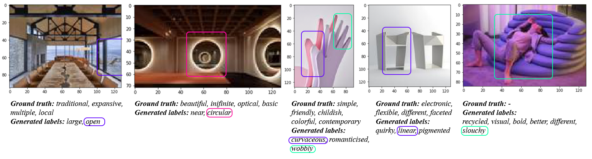

# Ambiguity-in-Computational-Creativity

Language is ambiguous; many terms and expressions convey the same idea. Despite advances in multimodal research and natural language processing, subjective reasoning and description remains unresolved. Multimodal machine learning can describe an image of “a girl wearing a red shirt” but is unable to describe or generate a “minimal, elegant and sleek looking chair”.  This is especially challenging in creative practice, where conceptual ideas and design intents are highly subjective. Today, digital design engines require an involved modeling processes performed as a series of procedural imperative commands — move, circle, radius, extrude, vertical, etc. These are coordinated around higher level design intents, expressed in natural language, say, as “the chair should look more minimal, elegant and sleek.” These well-defined commands can be viewed as software’s language translations of designer's’ conceptual ideas into action. Deep learning provides an alternative: the means to learn visual representations of subjective, ambiguous descriptions, such as dynamic, light or minimalist. This would reduce the need for a designer to reinterpret intent into software commands. 

# Publication
**Multimodal Word Sense Disambiguation in Creative Practice**
[[arXiv](https://arxiv.org/abs/2007.07758)]

   
  
  
 Visual word sense disambiguation. Coloured frames show image-words semantic relations

One of the main challenges in natural language processing (NLP) is making sense of ambiguous words and sentences. Word sense disambiguation (WSD) is the ability to computationally determine which connotation of a word is implied by its use in a particular context \cite{navigli}. Common problems in WSD are word sense representation, resolution in the distinction of senses, deciding how contexts are defined and the heavy dependency on knowledge external to the text. WSD can be viewed as a classification task, with intended meaning of the words operating as the classes and the words as the objects to be classified \cite{ijcai2018-812}. Thus, supervised learning techniques can be used to solve WSD. However supervised approaches are problematic due to the volume of labelled data required, time-consuming nature of annotation required to provision for the variability in lexical use, that the number of meanings in WSD tasks is in the order of thousands \cite{tripodi-navigli-2019-game}. Yet, most challenging ambiguity-related problems in computational linguistics are easily solved by humans. For instance, in a general context, the sentence \textit{I will read by the lake} has two possible meanings, reading some piece of text somewhere nearby the lake, and reading a text titled \textit{'by the lake'}. State-of-the-art neural machine translation models \cite{tang-etal-2019-encoders, sutskever2014sequence, cho-etal-2014-learning, kalchbrenner-blunsom-2013-recurrent, luong-etal-2015-effective} are capable disambiguating these two alternative meanings.

Creative practice (CP) is a broad term that encompasses those fields that produce creative work. Specifically, we refer as CP to any field that relies on visual mediums and feedback in the creative process. This includes work by designers, architects, visual artists or sculptors for example. In these domains, expressive language used to describe, discuss, disseminate and review work is crucial. Yet, it is especially subjective, inherently ambiguous and challenges clear classification with traditional techniques. For example, imagine a designer says to a colleague that they should \textit{Design the chair with a more dynamic look}; the word \textit{dynamic} conveys the design intent but it can be embodied in intractable number of representations, that is, forms and design variations. To further illustrate this, Fig. \ref{array}\footnote{Creators (row-wise): \textit{SO-IL, Bryanoji Design Studio, Gilles Miller Studio, Igenhoven Architects, Grimshaw Architects, Moarqs, A. Makoto, Gustafson \& Ståhlbom, F. Juhl, C. Kingsnorth, Osko+Deichmann, Dror, P. McDowell, Nike, Campana, Ying Gao, Adidas+A.Taylor, Y. Pardi}. Photography (row-wise): \textit{I. Baan, E. Wonsek and T. Oji, E. Bruzas, Igenhoven Architects, S. Gil, A. Garcia, L. Coleman, Dezeen, Dezeen, Dezeen, Dezeen, Dezeen, N. Nilsen, Dezeen, Dezeen, Dezeen, Dezeen, E. Phillips}.} shows images corresponding to the labels, from left to right: \textit{interesting, simple, organic, different, iconic, minimalist} in the ADARI sub-fields of architecture (top row), furniture (middle row) and fashion (bottom row). This highlights the complex interpretative relationship between descriptions of a workpiece and its form/image. It also leads us the following reserach question: \textit{is it possible to achieve a multimodal WSD through translations of ambiguous text to images?}

This paper introduces an initial dataset, the Ambiguous Descriptions and Art Images (ADARI) dataset of contemporary workpieces, which aims to provide a foundational resource for subjective image description in the context of CP. This has been assembled by collecting articles that include editorial descriptions along with associated images of the creative work. ADARI is an organized dataset of over 240k images and 260k descriptive sentences of visual work provided by the original \textit{creators} or by \textit{curators}. Our findings, explained in more detail in section \ref{amb_rel} and summarized in table \ref{ambiguity_analysis}, show that curators use a more objective language in their descriptions, whereas original creators choose a more ambiguous set of adjectives in their language. 

In addition to the dataset, we provide a baseline for subjective image description and multimodal disambiguation. The baseline architecture is a variant of the CNN-RNN framework proposed by \cite{wang2016cnn} and it is divided into three sections: a convolutional neural network (CNN) image encoder, a subjective label embedding, and a recurrent neural network (RNN) disambiguation decoder. We use a CNN pre-trained ResNet-152 encoder to generate image features, that, along the labels representations, are projected into a joint space. This is the input to the RNN decoder. The multi-label RNN decoder learns a joint low-dimensional image-label embedding to model the semantic relevance between images and labels. The long short-term memory (LSTM) recurrent neurons keep the label context information in their internal memory states, modeling the label co-occurrence dependency in the low-dimensional embedding. The process of generating subjective labels associated to a given image and to a context provides visual meaning to ambiguous words. Fig. \ref{disambiguation} demonstrate the potential of this approach for creative practitioners.
